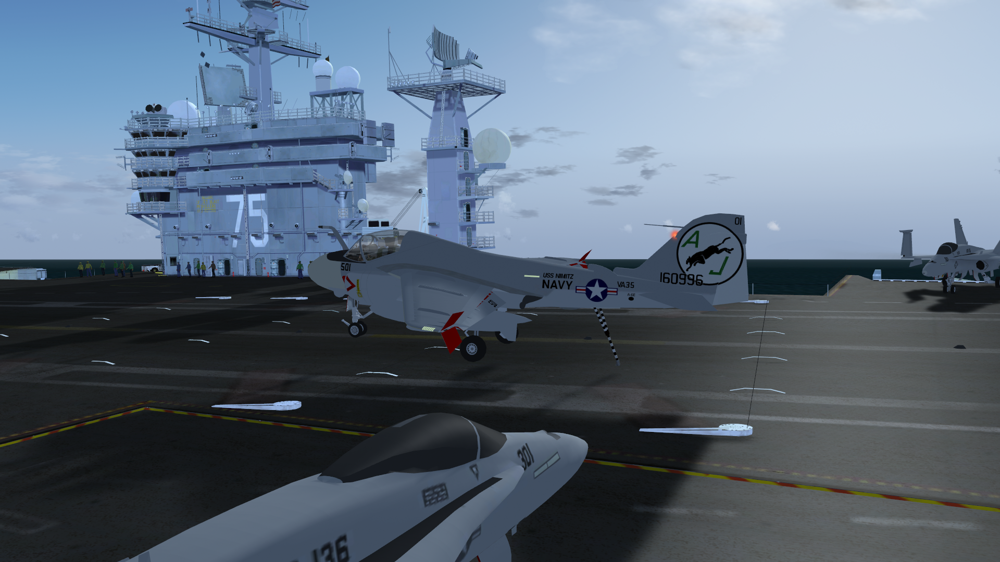

## Grumman A-6E Intruder for FlightGear

Maintainer: Jüttner Domokos

Based on the work of Alexis Bory

# Installation:
- Using releases: extract the release bundle into your aircraft directory, and add the
  aircraft directory as additional aircraft folder in the launcher.
- Using git: clone into your aircraft directory. Add the aircraft directory as
  additional aircraft folder in the launcher.

# Thanks to:
- Alexis Bory: Original A-6E for FlightGear
- Richard Harrison @Zaretto: Massive help with creating the VSPAERO FDM, adding carriers
  to the flight recorder
- @colingeniet: lights from the
  [Viggen](https://github.com/NikolaiVChr/flightgear-saab-ja-37-viggen/tree/master/Aircraft/JA37/Models/Effects/proc-als-lights)
- @l0k1: Stores menu from [MiG-21bis](https://github.com/l0k1/MiG-21bis)
